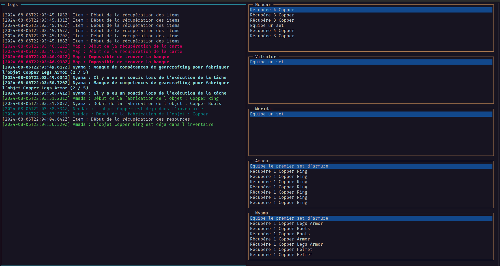

# Artifacts MMO

Ce projet contient le code source permettant d'interargir avec le MMO artifacts.

## Interface

.

## Dépendances

* NodeJS
* Typescript

## Installation

* Téléchargement du projet : `git clone git@github.com:Vilsafur/artifactsmmo.git`
* Installation des dépendances: `npm i`
* Build du projet: `tsc`
* Lancement du projet: `node build/index.js`

## Mise à jour de l'api

`npx swagger-typescript-api -p https://api.artifactsmmo.com/openapi.json -o ./src -n ApiArtifacts.ts`